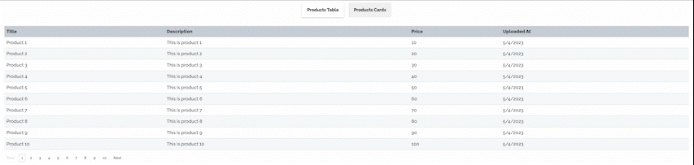
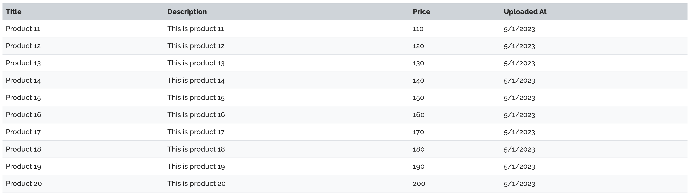
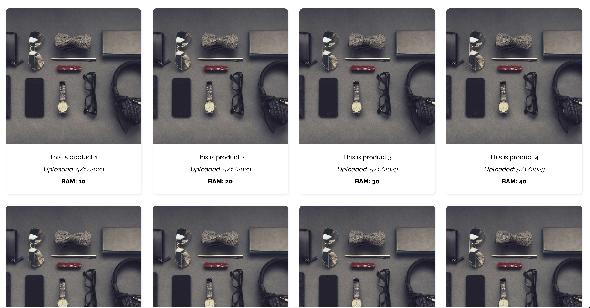

# [_React_][react] and [_Node.js_][nodejs] Workshop - Pagination Example

# Table of Contents

- [System Requirements](#system-requirements)
- [Instructions to run the app locally](#instructions-to-run-the-app-locally)
- [Theory behind pagination](#theory-behind-pagination)
  - [What is pagination](#what-is-pagination)
  - [Why do we need pagination](#why-do-we-need-pagination)
  - [How does pagination work](#how-does-pagination-work)
- [Exercises](#exercises)
- [Extra Exercises](#extra-exercises)

## System Requirements

- [git][git] v2.13 or greater
- [npm][npm] v8.16.0 or greater
- [NodeJS][node] `14 || 16 || 18`
- [MongoDB][mongodb] v6.0.0 or greater

&nbsp;

To verify things are set up properly, you can run this:

```shell
git --version
node --version
npm --version
mongod --version
```

&nbsp;

## Instructions to run the app locally:

1. Clone the repository

```shell
git clone https://github.com/TajibSmajlovic/pagination-workshop
```

2.  Setup the Server(Backend)

    - navigate to the server directory:
      ```shell
      cd server
      ```
    - in the server directory run:
      ```shell
      npm install
      ```
    - after installation of the dependencies is finished, run:
      ```shell
      npm start
      ```
    - (_Server will be running on http://localhost:3001_)

3.  Setup the Client(Frontend)

    - navigate to the client directory:

      ```shell
       cd client
      ```

    - in the client directory run:

      ```shell
      npm install
      ```

    - after installation of the dependencies is finished, run:

      ```shell
      npm start
      ```

    - (_App will be running on http://localhost:3000 in browser_)

&nbsp;

### That's it! You are ready to go! 🦾

&nbsp;

# Theory behind pagination:

> PLEASE: Don't skip this part, it is very important to understand the theory before moving to the exercises.

> REMEMBER: Practice should always follow theory!

&nbsp;

## What is pagination?

Pagination is a technique for dividing a list of items into discrete pages. In web applications, this is often achieved with the 'pagination' UI component, which contains pagination buttons that are used to navigate through the pages.

Example of numeric pagination 'UI' component:


There are several types of pagination: numeric pagination, load more pagination, infinite scrolling pagination, alphabetical pagination, date-based pagination, etc.

1. Numeric pagination: This is the most common pagination technique, where the pages are numbered and users can navigate to a specific page by clicking on the corresponding page number. For example, if you have 50 pages of search results, users can click on page 3 to go directly to that page.

2. Load more pagination: This technique is used when you want to display more items without loading a new page. When the user reaches the end of the page, a "Load More" button is displayed, which allows the user to load more items without navigating to a new page.

3. Infinite scrolling pagination: This technique is similar to load more pagination, but instead of a button, new items are loaded automatically as the user scrolls down the page. This technique is often used in social media feeds where new posts are loaded as the user scrolls down the page.

4. Alphabetical pagination: This technique is used when you have a large dataset that is sorted alphabetically. The letters of the alphabet are displayed on the page, and users can click on a letter to see all the items that start with that letter. For example, if you have a list of contacts, users can click on the letter "A" to see all the contacts whose names start with "A".

5. Date-based pagination: This technique is used when you have a large dataset that is sorted by date. The pages are divided by date ranges, such as "Last 7 Days", "Last 30 Days", or "This Year". Users can click on a date range to see all the items within that range.

Example of numeric pagination:



Other type of pagination is called "infinite scroll". This type of pagination is used by most of the social media platforms like Facebook, Instagram, Twitter, etc.

Example of infinite scroll pagination on desktop screen:


Example of infinite scroll pagination on mobile screen:


In this workshop we will be implementing numeric and infinitive scrolling pagination.

## Why do we need pagination?

Pagination is used to improve the performance of the application. Imagine that you have a list of 1000 items that you want to display on the page. If you load all of the items at once, it will take a lot of time for the page to load. This is where pagination comes in handy. Instead of loading all of the items at once, you can load only a certain number of items per page. This will improve the performance of the application and will make the user experience better.

Pagination increases user experience since the users can navigate through pages easily and quickly, and making it easier for users to find specific information within a large data set.

Some other benefits of pagination are:

- Reduced server load: With pagination, the server only needs to return a subset of the data at a time, rather than the entire data set. This can reduce the load on the server and improve overall system performance.

- Scalability: As the amount of data grows, pagination can be used to ensure that the application remains responsive and efficient. Without pagination, loading large data sets could cause the application to become slow and unresponsive.

- Reduced network traffic: With pagination, the client only needs to request a subset of the data at a time, rather than the entire data set. This can reduce the amount of data that needs to be transferred over the network, which can improve overall system performance.

## How does pagination work?

Pagination works by dividing the list of items into discrete pages. Each page contains a certain number of items. The number of items per page is called the "page size". The page size is usually set to 10, 20, 50, or 100 items per page. The page size can be set to any number, but it is usually set to one of the above-mentioned numbers.

For example, if you have 1000 products to display, instead of loading them all at once, you can break them up into smaller pages, such as 10 products per page. This means that the user can view the first 10 products on the first page, then click a button to go to the next page and see the next 10 products, and so on.

From the backend perspective, pagination works by dividing the data into smaller chunks or subsets and returning only a subset of data to the client on each request. The process involves the following steps:

- The client sends a request to the server via [query params][query-params] for a specific page with a defined page size
  - the name of the query params can be anything, but the most common are: `page` and `pageSize`
- The server receives the request and calculates the offset and limit values to determine the subset of data to be returned
- The server retrieves the subset of data from the database using the offset and limit values
- The server sends the subset of data to the client
- The client displays the subset of data on the page
- The client can then request additional pages of data, and the process repeats until all data has been retrieved

By using pagination, the server can minimize the amount of data it needs to retrieve from the database, which reduces the server's workload and makes the application more responsive.

From the frontend perspective there are only two things that are important:

- pass the correct query params to the backend
- display the correct data on the frontend

How it looks to implement the pagination on both backend and frontend you will discover in the following exercises.

&nbsp;

# Exercises:

> NOTE 1: make sure to go though the whole codebase before starting to implement pagination. Your staring point for the backend should be server.js and for the client should be index.js

> NOTE 2: start with the backend first and then move to the frontend

> NOTE 3: follow comments in order to implement pagination

&nbsp;

On the server(backend), there should be made changes in two files in order to implement pagination:

- `src/controllers/ProductController.js` : responsible for handling the requests and responses - within this file, major chunk of pagination login should be implemented
- `src/services/ProductService.js` : responsible for fetching the products from the database

&nbsp;

On the client(frontend), there should be made changes in three files in order to complete pagination:

- `src/components/Pagination.js` : responsible for rendering the pagination buttons that are part of the table and are used to navigate through the pages

  

- `src/Products/ProductsTable.js` : responsible for rendering the products within the table

  

## Extra Exercises:

<details>

  <summary>Client/Frontend</summary>

For extra frontend exercise you will implement the type of pagination that is most commonly used in the real world. This type of pagination is called **infinite scroll**. The idea behind this type of pagination is that the user doesn't have to click on the pagination buttons in order to navigate through the pages. Instead, the user can just scroll down and the next page will be loaded automatically. This type of pagination is used by most of the social media platforms like Facebook, Instagram, Twitter, etc.

Changes should be made in the following file:

> NOTE: follow the comments in order to implement infinite scroll

- `src/Products/ProductsCards.js` : responsible for rendering the products within as a list of cards



</details>

<details>

  <summary>Server/Backend</summary>

For the extra backend exercise you will refactor the pagination logic in the `src/controllers/ProductController.js` file you initially wrote. The idea is to move the some of the logic from the controller to utility functions that will be defined in the `src/utils/pagination.js` file. The functions that should be defined are:

- `generatePaginationVariables` : responsible for generating the variables that are used for pagination
- `generatePaginationPageResponse` : responsible for generating the `next` object property from the response object that is sent to the client

> NOTE: follow the comments in order to solve this exercise

- `src/utils/pagination.js` : responsible for generating the variables that are used for pagination

After the functions are implemented, you should refactor the `src/controllers/ProductController.js` by importing the functions from the `src/utils/pagination.js` file

</details>

[npm]: https://www.npmjs.com/
[node]: https://nodejs.org
[git]: https://git-scm.com/
[mongodb]: https://www.mongodb.com/
[react]: https://reactjs.org/
[nodejs]: https://nodejs.org/en/
[query-params]: https://www.abstractapi.com/api-glossary/query-parameters#:~:text=Query%20Parameter%20Example,parameters%2C%20forming%20a%20query%20string.
